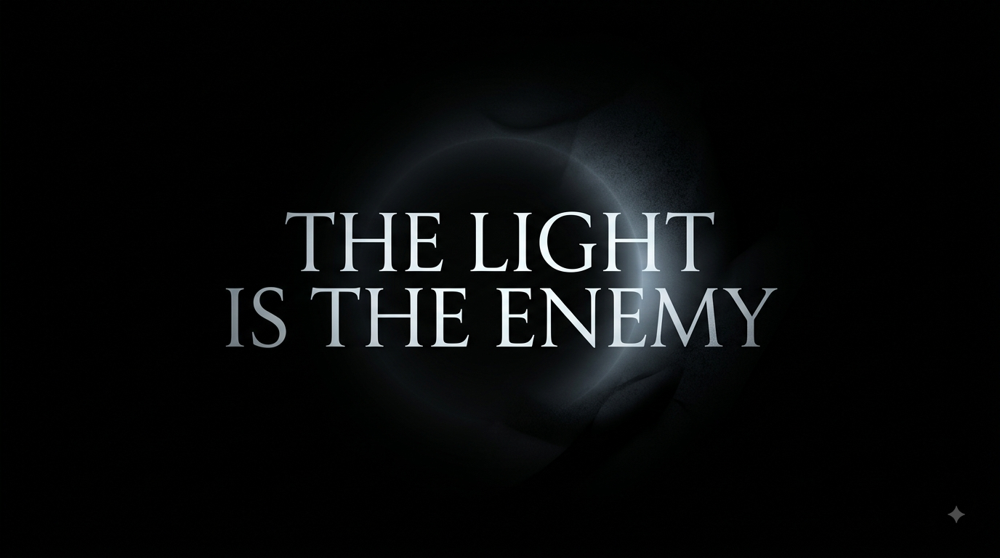

# The Light Is the Enemy

<p align="center">
  
</p>

> A top-down survival horror game where darkness isn't just atmosphere — it's part of the threat.

Explore procedurally built rooms in near-total darkness. Your flashlight reveals the world, draws attention, and drains power. Enemies watch, listen, and hunt. Restore backup power, then escape — if you can.

**Stack:** HTML5 Canvas · Web Audio API · vanilla ES modules · no build step

---

## 🎮 About

**The Light Is the Enemy** is a browser-based psychological survival horror game.

You move through dark industrial spaces with severely limited visibility. A small ambient glow keeps the immediate area around you readable; your flashlight is the real light source — and using it has consequences. Enemies react to proximity, line of sight, movement, sprinting, and illumination. Audio carries threat: footsteps, breathing, heartbeat, and music respond to danger.

Rooms are generated from seeds with themed dressing and layout variants. Each room follows an objective chain: find a fuse, restore the generator, reach the exit. Stamina and flashlight battery are independent pressures.

The game deliberately avoids turning the map into a fully lit space.

---

## 🕯️ Core Gameplay

1. Enter a dark room  
2. Explore with limited visibility  
3. Find the fuse (electrical panel / housing)  
4. Pick it up with **`E`**  
5. Locate the backup generator  
6. Install the fuse with **`E`**  
7. Escape through the exit once power is restored  
8. Survive enemies along the way  

| Capability | Detail |
|------------|--------|
| Movement | WASD / arrows; smooth acceleration and wall sliding |
| Sprint | Stamina-limited bursts |
| Flashlight | Mouse aim; hold LMB or toggle **`F`** |
| Interaction | **`E`** for fuse pickup and generator install |
| Progression | Clear a room → next seeded layout; difficulty scales per room |

Room 1 includes a short tutorial. Contextual hints appear when you stall on an objective phase.

---

## 👁️ Horror Systems

**Darkness & visibility** — Heavy darkness overlay; small always-on ambient circle at the player's feet; flashlight cone as primary illumination. Visibility is ray-based: walls and corners block sight. Flashlight **range does not shrink** with battery; low charge causes flicker, then shutoff.

**Threat** — Continuous 0–1 value driven by enemy proximity, AI state, line of sight, illumination, and sprinting. Rises quickly (rate 2.8), falls slowly (rate 0.65). Drives heartbeat, breathing, and threat music.

**Audio** — Spatialized mix: ambience bed, threat music, heartbeat, footsteps, breathing, stings. MP3 assets with procedural fallbacks for some layers. Audio init is fail-soft and never blocks gameplay.

---

## 👹 Enemies

| Archetype | Character |
|-----------|-----------|
| **STALKER** | Balanced hunter; strong illumination response; persistent search |
| **RUNNER** | Fast once alerted; shorter search window |
| **WATCHER** | Stationary; long awareness range; slow to chase |

States: `DORMANT` → `AWARE` → `ILLUMINATED` → `ALERT` → `HUNTING` → `SEARCHING` → `LOST`

Enemies react to proximity, line of sight, sprinting, and flashlight illumination. Canvas-rendered silhouettes with archetype-specific shapes.

---

## 🔦 Resources

### Stamina

| Parameter | Value |
|-----------|-------|
| Max | 100 |
| Sprint drain | 26 / s |
| Recharge | 30 / s |
| Recharge delay | 0.7 s |
| Restart threshold | 10% |

### Flashlight power

| Parameter | Value |
|-----------|-------|
| Max | 100 |
| Drain (base) | 9 / s while on |
| Recharge | 6.5 / s while off |
| Recharge delay | 1.5 s |
| Restart threshold | 5% |
| Early rooms | Reduced drain in rooms 1–3 |

Battery drain scales per room via `DifficultySystem`. Beam range stays constant.

---

## 🔌 Objectives

**Find fuse → Pick up (`E`) → Find generator → Install (`E`) → Escape**

- Fuse and generator are separate world positions with landmarks (fuse station, generator equipment, cables).
- Exit is locked until the generator is powered.
- Objectives are connectivity-validated from spawn during generation.
- HUD prompt: `PICK UP FUSE [E]` / `INSTALL FUSE [E]` when in range.

---

## 🎮 Controls

| Desktop | |
|---------|---|
| Move | `W A S D` / arrows |
| Aim | Mouse |
| Flashlight hold | Left mouse button |
| Flashlight toggle | `F` |
| Sprint | `Shift` |
| Interact | `E` |
| Pause | `Esc` |

| Mobile | |
|--------|---|
| Move | Left joystick |
| Aim | Right drag zone |
| Flashlight / sprint | On-screen buttons |

---

## 🛠️ Development

There is **no `package.json`** and no bundler. The game runs as static files served over HTTP (ES modules require a server).

### Run locally

From the project root:

```bash
python -m http.server 8765
```

Open `http://localhost:8765` — any port works; `8765` is what has been used during development.

Click **Play**, skip or watch the intro, and play room 1.

`window.__game` is exposed in the browser console after load.

### Debug URLs

Parsed once at startup in `Game.parseLaunchParams()`:

| URL | Effect |
|-----|--------|
| `?debug=true` | On-screen overlay: FPS, game state, fuse/generator distances, interaction counters, canvas debug markers |
| `?debug=true&objective=fuse` | Skips intro; places fuse ~6 tiles from spawn for objective testing |
| `?debug=audio` | Audio debug overlay; `window.__audio`; probe keys F9–F12, `=`, `-` |
| `?debug=flashlight` | Draws flashlight visibility polygon on screen |
| `?flashlight-simple=true` | Simplified flashlight fill (combine with `?debug=flashlight`) |

---

## 🧱 Technical Architecture

Vanilla JavaScript ES modules. 47 source files under `src/`.

```text
the-light-is-the-enemy/
├── index.html
├── css/                    reset, main, menu, game styles
├── assets/                   MP3 audio (see Assets)
├── scripts/                Headless tests and dev tools
└── src/
    ├── main.js
    ├── core/
    │   ├── Game.js
    │   ├── GameLoop.js
    │   ├── Input.js
    │   ├── Time.js
    │   └── EventBus.js
    ├── player/
    │   ├── Player.js
    │   ├── PlayerController.js
    │   └── Flashlight.js
    ├── enemies/
    │   ├── Enemy.js
    │   ├── EnemyAI.js
    │   └── EnemyManager.js
    ├── world/
    │   ├── RoomGenerator.js
    │   ├── Room.js
    │   ├── RoomThemes.js
    │   ├── TileMap.js
    │   ├── Collision.js
    │   └── Visibility.js
    ├── systems/
    │   ├── ObjectiveSystem.js
    │   ├── ThreatSystem.js
    │   ├── DifficultySystem.js
    │   ├── SaveSystem.js
    │   └── ResourceMeter.js
    ├── audio/
    │   ├── AudioManager.js
    │   ├── AudioMixer.js
    │   ├── AudioAssets.js
    │   ├── SpatialAudio.js
    │   ├── FootstepPlayer.js
    │   ├── RoomAmbience.js
    │   └── ProceduralSounds.js
    ├── effects/
    │   ├── Lighting.js
    │   ├── LocalLight.js
    │   ├── ScreenEffects.js
    │   ├── Particles.js
    │   └── CameraShake.js
    ├── characters/
    │   ├── PlayerRenderer.js
    │   └── EnemyRenderer.js
    ├── ui/
    │   ├── HUD.js
    │   ├── Menu.js
    │   ├── DeathScreen.js
    │   ├── Tutorial.js
    │   ├── HintSystem.js
    │   └── TouchControls.js
    └── utils/
        ├── Constants.js
        ├── Geometry.js
        ├── MathUtils.js
        └── Random.js
```

### System responsibilities

| Module | Responsibility |
|--------|----------------|
| **Game** | Top-level state machine (`MENU` → `PLAYING` → `DEAD` / `TRANSITIONING`), orchestrates update/render, room loads, menu flow, debug modes |
| **GameLoop** | `requestAnimationFrame` loop; isolates update/render errors so one frame failure does not kill the loop |
| **Input** | Keyboard, mouse, and touch abstraction; pressed vs held; interact (`E`) routing |
| **Player** | Position, velocity, stamina meter, body angle, alive state |
| **PlayerController** | Movement from input, wall collision, sprint logic, flashlight aim |
| **Flashlight** | Beam angle smoothing, battery drain/recharge, flicker at low power; range independent of charge |
| **Enemy** | Entity state, movement, collision, archetype config |
| **EnemyAI** | Awareness accumulation, state machine transitions, search patrol |
| **EnemyManager** | Spawn from room data, per-frame updates, illumination events, attack → death |
| **ThreatSystem** | Continuous 0–1 threat from enemies, LOS, illumination, sprinting; smooth rise/fall |
| **ObjectiveSystem** | Fuse → generator → escape phases; `E` pickup/install; HUD events |
| **ResourceMeter** | Generic drain/recharge/delay meter used by stamina and flashlight |
| **Geometry** | Flashlight visibility polygon, raycasts, line-of-sight — **foundational; do not casually change** |
| **Lighting** | World render, darkness overlay, ambient player glow, flashlight mask, environmental lights |
| **AudioManager** | Web Audio lifecycle, threat-driven mix, footsteps, heartbeat, breathing, stings |
| **AudioMixer** | Bus levels and smooth gain targets (master, ambience, sfx, heartbeat, etc.) |
| **SpatialAudio** | Stereo panning and distance attenuation for positioned sounds |
| **RoomGenerator** | Seeded layout carving, objective placement, reachability validation, decor/landmarks |
| **RoomThemes** | Theme metadata, decor types, landmark definitions, rotation order |

Supporting modules: `Room` (interaction radii, exit lock), `TileMap` / `Collision` (walls only — decor is visual), `Visibility` (illumination tests), `LocalLight` (env light cutouts), `SaveSystem` (settings + best run in `localStorage`), `DifficultySystem` (per-room scaling).

---

## 🧠 Architecture Decisions

**Visibility** — The raycast visibility polygon in `Geometry.js` is stable and foundational. Flashlight rendering and enemy illumination both depend on it. Treat changes as high-risk.

**Resources** — Stamina and flashlight power are independent `ResourceMeter` instances with separate drain/recharge rules.

**Threat** — Threat is a continuous float smoothed toward a raw target, not discrete distance bands. Audio reads `ThreatSystem.intensity`.

**Audio** — Initialization is fail-soft: missing MP3s log warnings and fall back to `ProceduralSounds` where implemented. Audio must never prevent the game from starting or stop the render loop.

**Objectives** — Fuse and generator are explicit phases in `ObjectiveSystem` with separate world positions. Pickup and install both require `E` in range.

**Collision** — Only `TILE.WALL` blocks movement. Decorative dressing (`room.decor`) is rendered in `Lighting.js` and must not be added to the tile collision grid.

---

## 🧪 Testing

Headless Node scripts (no browser required):

```bash
node scripts/test-movement.mjs
node scripts/test-collision.mjs
node scripts/test-visibility.mjs
node scripts/test-objective-lifecycle.mjs
```

| Script | Validates |
|--------|-----------|
| `test-movement.mjs` | Diagonal speed normalization, body angle smoothing |
| `test-collision.mjs` | Circle–tile wall sliding, axis-separated resolution, corner tunneling |
| `test-visibility.mjs` | Visibility polygon correctness, wall occlusion, cone geometry edge cases |
| `test-objective-lifecycle.mjs` | Fuse/generator reachability from spawn (2500 rooms), `E` pickup state transitions |

### Dev / diagnostic tools

| File | Purpose |
|------|---------|
| `scripts/analyze-audio.html` | Browser page: loads and analyzes MP3 peak/RMS/duration via `AudioAssets` |
| `scripts/diagnose-flashlight-jitter.mjs` | Standalone numeric check for screen-space wall jitter vs camera bob |
| `scripts/browser-fuse-pickup.mjs` | Optional Puppeteer browser test; spawns its own server on port 8766; requires Puppeteer + Chrome installed — **not part of CI** |

Browser gameplay is validated manually. The Puppeteer script exists but depends on local Chrome and is environment-sensitive.

---

## 📁 Assets

Audio files in `assets/` (loaded by `AudioAssets.js`):

| File | Purpose |
|------|---------|
| `menu-music.mp3` | Main menu |
| `scary-ambience.mp3` | Horror ambience bed |
| `high-threat-music.mp3` | Threat escalation music |
| `footsteps.mp3` | Player footstep slices (peak-detected at load) |
| `pic-up-object.mp3` | Objective pickup |
| `enter-exit-door.mp3` | Room transition |
| `game-over.mp3` | Death |

Heartbeat, breathing, flashlight click, and some footstep fallbacks are synthesized via `ProceduralSounds.js` when needed.

---

## 🗺️ Development Status

### Completed

- Core gameplay loop (movement, collision, camera, pause/death)
- Ray-based flashlight visibility and darkness overlay
- Independent stamina and flashlight power
- Continuous threat system with audio coupling
- MP3 + procedural audio architecture (fail-soft loading)
- Three enemy archetypes with awareness state machine
- Fuse → generator → escape objective flow with `E` interaction
- Seeded room generation with themes, decor, landmarks, reachability validation
- Environmental horror pass (lighting, dressing, threat audio, silhouettes)
- Mobile touch controls
- Headless regression tests for movement, collision, visibility, objectives

### Current focus

No formal roadmap is checked into the repository. Active iteration is around **horror readability** — objective discoverability, ambient player visibility, interaction reliability, and tuning darkness/lighting contrast without breaking the visibility or collision foundations.

---

## ⚠️ Known Limitations

- **No build tooling** — no `package.json`, bundler, or automated browser test suite in-repo.
- **Static server required** — ES modules will not load from `file://`.
- **Audio asset dependency** — core mood relies on MP3s in `assets/`; missing files degrade gracefully but sound quality varies.
- **Single-player browser only** — no multiplayer, saves, or persistent campaign beyond best-room / settings in `localStorage`.
- **Touch UI** — present but less exercised than keyboard/mouse desktop play.
- **Objective discovery** — no quest markers; finding the fuse/generator depends on exploration, environmental cues, and light.

---

## 🤝 Development Notes

This is an actively developed horror game prototype, not a finished product. Systems are intentionally iterated around **atmosphere, tension, exploration, and readability under constraint**. When changing code, prefer extending existing systems over parallel implementations — especially for visibility, collision, and audio lifecycle.

Settings (volume, screen shake, visual effects) persist via `SaveSystem` / `localStorage`.

---

## 🎯 Design Intent

> *The absence of information is the art direction.*

Darkness hides threats and objectives. Light reveals them — but also reveals **you**. Sound fills the gaps when the beam is off.

---

*The Light Is the Enemy — a browser horror game in active development.*
